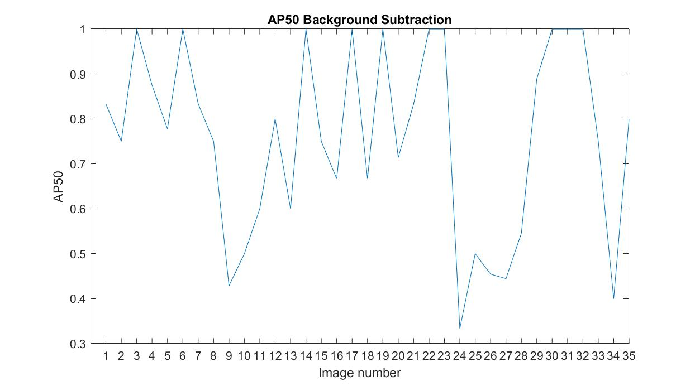
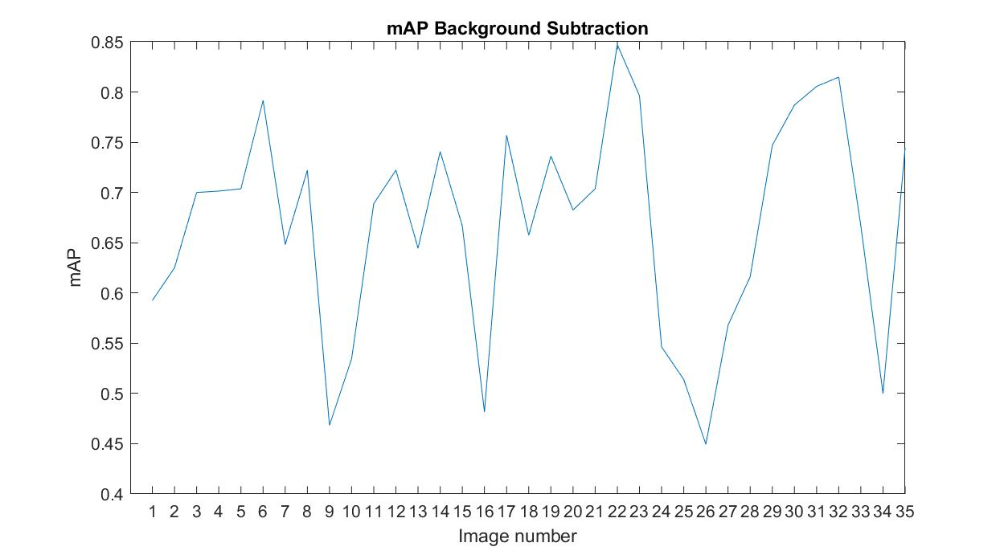

# Car detection
Project for school subject Advanced Image Processing

# GUI

# Results 
## Foreground detector 
### AP 50

Result : 52.96%

### mAP

Result : 53.68%

## Background subtraction
### AP 50

Result : 75.70%

### mAP

Result : 66.77%
